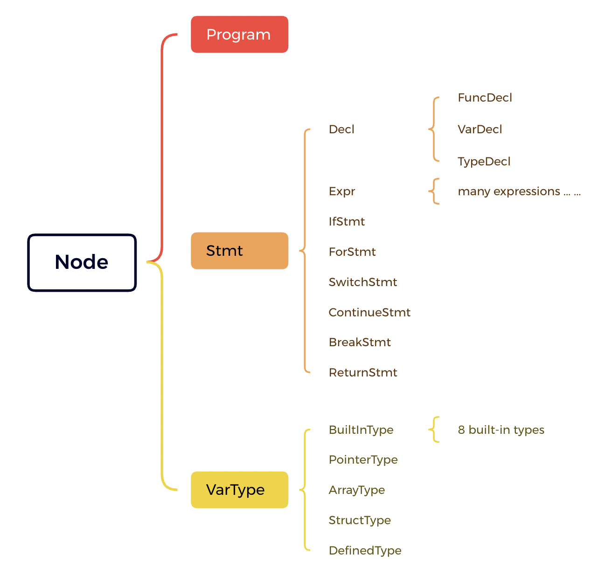
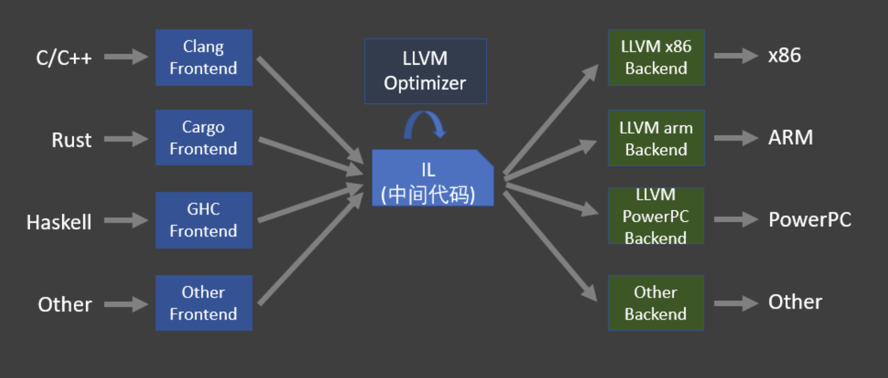
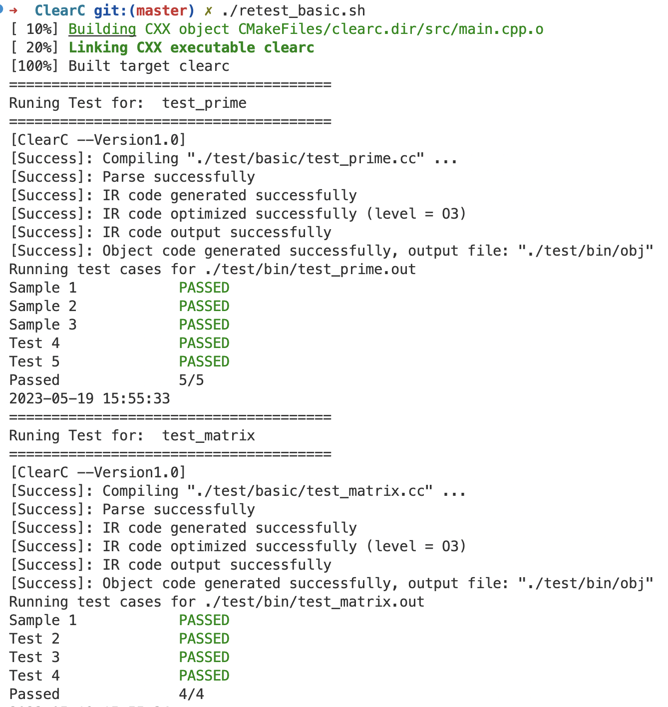
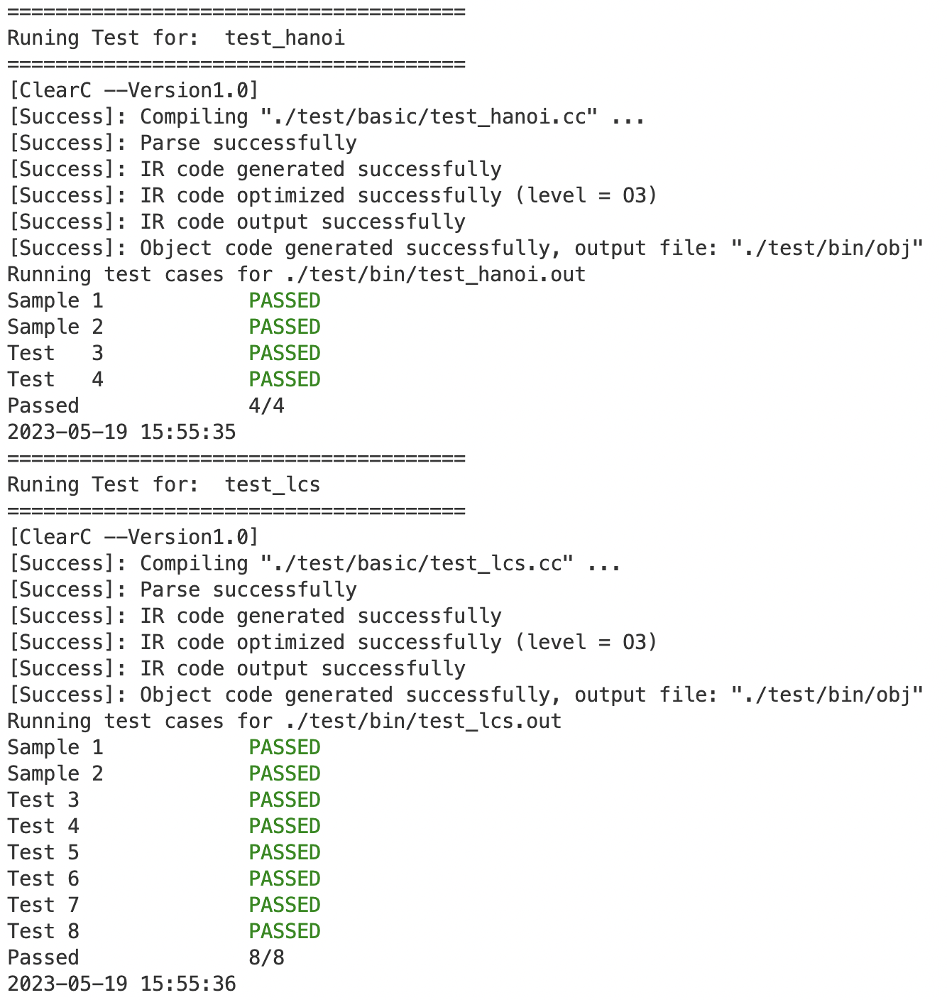
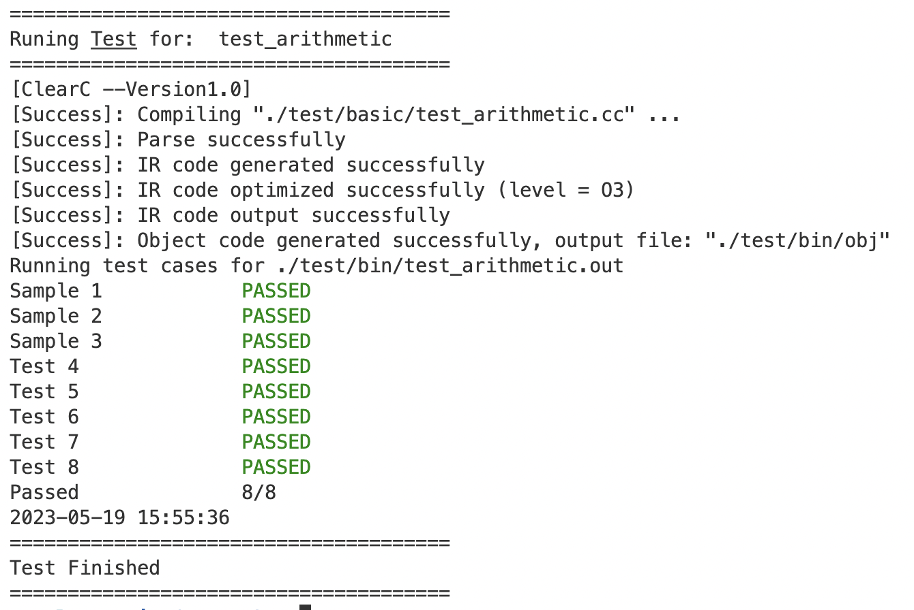

# 编译原理大作业-ClearC实验报告

姓名：管嘉瑞

学号：3200102557

学院：计算机科学与技术学院

指导老师：刘忠鑫

日期：2023年5月26日


## 1. ClearC语言特性

### 1.1 介绍

本次实验要求实现Tiger语言或一个类C或类PASCAL语言的编译器, 也可以自己创造一个功能等价的新语言。

我选择实现一个类C语言，将其命名为**ClearC**。ClearC的设计宗旨是**简洁明了**。它在C语言的基础上简化、明确了语法，如取消了while而全部用for代替；ClearC抛弃了枚举(enum)、联合(union)等相对复杂的概念；ClearC支持const声明；ClearC实现了部分的OOP特性，支持成员函数，能实现简单的封装和面向对象编程，风格类似Go语言。

在编译器设计方面，使用flex生成词法分析器，使用bison生成语法分析器，然后需要讲抽象语法树转化成LLVM的IR(这也是本项目的难点)，最后对IR进行优化后由LLVM生成目标代码。

最后经过测试，ClearC编写的程序可以实现相应的功能，能够通过所有助教提供的测试点。

### 1.2 语言特性

以下部分是我在写ClearC时同步编写的英文文档中的一部分。

1. **Macro and File**: 

    No macros. (`#define`, `#include` not available, no code pretreat)

    Multi-file coding managing tools like a package manager is not provided yet, only single source code file available.

2. **Pointer**: In C, ` *` has three meanings: multiply, declare a pointer, pointer dereference, which will make the compling procedure complicated and confusing.
    In ClearC, we use the critical word `ptr` to declare a pointer, and use `dptr` to dereference.

    We also use `addr()` to get the address instead of using `&`.

    `[]` is still available to dereference based on bias.

    **Pointers can NOT do self-increment/decrement in ClearC**. Pointer calculation is also not recommended.

    example.

    ```c
    int a = 1;
    ptr<int> pa = addr(a);
    dptr(pa) = dptr(pa) + 1; //or pa[0] = pa[0] + 1;
    pa++; //illegal
    ```

3. **Array**:

    array in ClearC has very limited functionality.

    array<`type`, `size`> name; is the legal declaration for an array. Array is regarded as a type as well, which is const ptr<`type`>.

    ```c
    array<int, 100> arr;
    array<ptr<int>, 5> arrp;
    arrp[0][0] = 2;
    ```

    Array is viewed as const ptr<>, with fixed head address assigned during initialization. 

    **We do NOT provide initialiazation method for array!** You have to assign it one by one.

    ```c
    array<char, 10> str = "hello"; //illegal
    array<int, 13> ints = {1, 2, 3}; //illegal
    ```

    Array can assign to pointers, but cannot be assigned, since it's "const".

    Array base type cannot be void or const;

    ```c
    array<char, 10> str =;
    array<char, 10> str1;
    ptr<char> ps = str; //legal
    str = ps; //illegal
    str = str1; //illegal
    array<char, 10> str2 = ps; //illegal
    array<const int, 10> arr1; //illgeal
    array<void, 10> arr2; //illgeal
    ```

    Array type can not be the function return type, since we don't want any array to accept the return value.

    Array type can neither be passed as function arguments, since it cannot be initialized.

    ```c
    func getArr() -> array<int, 10>; //illegal
    func printArr(array<char, 10>) -> void; //illegal
    ```

    If you want to use array more  flexibly, we recommend to use pointers.

    

4. **Function**

    We want the function declaration more clear.

    func `funcname` (`args list`) -> `return type` { `funcbody` }

    ```c
    func sum(int a, int b) -> int {
      return a + b;
    }
    ```

    Function in ClearC must have a return statement, even if it has void return type.

    Look at OOP for more function formats.

5. **struct**, class, union, enum

    - `struct {Fileds;};` is a data type defined by programmers, which is a anonymous and temporary.

        You should use `typedef A struct {Fileds.};` to name this type "A".

        Fileds equality does not mean that structs are equal.

        ```c
        struct {int x; int y;} a;
        struct {int x; int y;} b;
        a = b; //illegal
        
        typedef Point struct {int x; int y;};
        Point r;
        Point s;
        r = s; //legal
        ```

        class is not a critical word, which is replaced by  `typedef A struct {Fileds.};`

    - Member variable in struct is public only if it starts with capital letters.

    - **`union` and `enum` are temporarily abandoned in ClearC.**

    

6. **const** and static

    Usually, const means a variable cannot change its value, so it will remain the initial value forever.

    ptr<`const varType`> is a specially grammar (inner-const), which means nobody can modify the variable pointed by this pointer **through this pointer**, and there are some rules (just like in C).

    - Two const:
        - Outer-const: The variable itself is const, it's value can only be initializaed, but not be assigned.
        - Inner-const: A feature of pointer. Cannot modify the content through inner-const pointer.

    - Rules:

        - const variable can only pointed by ptr<`const`> (Outer const variable can only be pointed by inner-const pointer)

        - Variable pointed by ptr<`const`> may change its value(if it's not const), but cannot change through the ptr<`const`>.

        - const ptr must point to the fixed address, but the value in this address may change.

        - Cannot assign ptr<`const`> to ptr which is not inner-const. Function with ptr<`const`> argument can neither receive non-inner-const pointer.
        - Cannot type cast a ptr<`const`> to a non-inner-const pointer.
        - Array type variable wil be regarded as outer-const pointer.

    ```c
    const varType v = val_0; //this var cannot be modified
    v = val_1; //illegal
    ptr<varType> pv = addr(v); //illegal: v may be modified through pv. addr(v) is type ptr<const varType>
    
    ptr<const varType> pcv = addr(v); //legal
    dptr(pcv)= val_2; //illgeal: cannot modify v through pcv
    pv = pcv; //illegal: ptr<const varType> cannot assign ptr<varType> (or const ptr<varType>)
    pv = typecast(pcv, ptr<varType>); //illegal: annot type cast inner-const to non-inner-const
    
    const ptr<varType> cpv= null; //cpv cannot be modified
    cpv = pv //illegal: const ptr cannot be assigned
    
    ```

    For a const struct variable, all member variables are also const.

    Const members is always const.

    ```c
    typedef Point struct{
    	int x;
    	int y;
      const int cval;
    };
    const Point p;
    p.x = 1; //illegal
    ptr<const Point> pp = addr(p);
    pp->y = 1; //illegal
    
    Point p1;
    p1.cval = 1; //illegal
    ```

    Result of arithmetic operation on inner-const pointer will still be inner-const.

    **`static` is abandoned in ClearC.**

    

7. **typedef**

    ClearC use `typedef name type` instead of  `typedef type name` in C.

    ```c
    typedef MYINT int;
    
    //this is just like class Dog{};
    typedef Dog struct{
      array<char, 10> name;
    }
    ```

8. **typecast**

    In ClearC, explicit typecast is in a more obvious way;

    ```c
    int a = 1;
    float f = typecast(a, float); //like float f = (float)a in C;
    ```

    Supported type cast:

    - Int -> Int, Float

    - Float -> Int, Float

    - Pointer -> Int, Pointer 

    Implicit typecast may also happen.

    **Cannot type cast an inner-const pointer to a non-inner-const pointer.**

    Pointer can type cast to a pointer with different base type, we don't figure out how to forbid this. However, it's mot recommended to do so.

    **Again, pointer cast with different base type is very dangerous and not recommended!**

    

9. **auto** (Version1.2)

    After Version1.2, ClearC supports `auto` for variable declaration.

    ```c
    auto x = 1;
    auto y = x;
    auto s = stu; //stu is a Student struct type
    ```

     There are some important points:

    - `auto` must be used for variable declaration with initialize expresion. Cannot declare an auto type variable separately.

        ```c
        auto x; //illegal
        ```

    - `const` (outer-const) will not be inherited by auto (just like C).

        ```c
        const int a = 1;
        auto b = a; //b is not a const variable
        b = 2; //legal
        ```

    - Inner-const will be inherited by auto

        ```c
        const int a = 1;
        ptr<const int> p = addr(a);
        auto pa = p; //pa is an inner-const pointer
        dptr(pa) = 2;//illegal
        ```

    - `auto` type cannot be the function argument type or return type

        ```c
        func f(auto) -> int {} //illegal
        func f() -> auto {} //illegal
        ```

    - Initialized by array is not recommended (but available). 

        ```c
        array<int, 10> arr;
        auto a = arr; //not recommended.
        ```

        

10. **Control Grammar**

      In `if, for, switch`, **condition does NOT need to be in `()`, but the body code must be in `{}`**

       Declaration is allowed in for's initial statement (like c++).

       We use `for condition {}` to replace `while condition {}`.  `for{}` is unconditional loop.

       So `while` is not a critical word in ClearC.

       **`do{} while`  is abandoned in ClearC.**

    ```c
    //legal
    for int i = 0; i < n; i++ {
    	sum += i;
    }
    
    //illegal
    for int i = 0; i < n; i++
    	sum += i;
    
    //illegal
    for (int i = 0; i < n; i++) {
    	sum += i;
    }
    
    //legal
    for i < 10 {
      sum += i;
      i++;
    }
    
    //legal
    for {
      if i > 5{
        break;
      }
      i++;
    }
    ```

11. naming

     For an identifier, it may be the name for a function, type or a variable, or may not be defined yet.

     In Version1.1, we maintain three symbol tables, for function, type and varaiable. So symbols of different kinds can have the same name in the same "symbol frame".

    ```c
    // a legal program after Version1.1
    typedef Student struct{}; //type
    func Student(Student Student) -> void; //function
    
    func f() -> void{
    Student Student; //var
     Student(Student);
    }
    ```

12. **OOP** (Encapsulation, Member Function)

       We want to make the OOP style like golang, but a little different.

      `func BaseType : funcname(args list) -> return type {funcbody}`    

    ```c
    func Student : SetScore(float score) -> void {
    this->score = score; 
    }
    //func SetName(const ptr<Student> this, array<char, 10> name) -> void {
    //this->name = name;
    //}
    
    func Student : GetId() -> int {
    return this->id;
    }
    //func GetId(const ptr<Student> this) -> int {
    //return this->id;
    //}
    
    Student s;
    s.SetScore(95);
    
    ptr<Student> ps = addr(s);
    int sid = ps->GetId();
    ```

      - The basetype of function is in fact a `const ptr<basetype>`  at the first position of the args list. It will represented by critical word `this` in funcbody.

      - The basetype must be a struct type defined by programmers.

      - `variable.Func()`, `varptr->Func()` can call memeber function, just like C.

      - Call a member function of other types(structs) will raise semantic error.

      - ClearC does NOT provide inheritance and polymorphism, it's OOP style is more like Go.

      - **Member functions of different base types can NOT have the same name, otherwise will raise naming conflict error.**

      - There are **private/public constraint** for members variables and functions for structs. 

        **Functions / variables starting with uppercase English letters is public, otherwise private. Private members can only be accessed in its member function.** (like golang)

13. Supported operatiors

      ClearC supports almost all operators in C.

      ```c
    "<<="													//left shift assign
    "<<"													//left shift
    ">>="													//right shift assign
    ">>"													//right shift
    "=="													//equal
    ">="													//greater or equal than
    ">"														//greater than
    "<="													//less or equal than
    "<"														//less than
    "!="													//not equal
    "!"														//not
    "="														//direct assign
    "&&"													//and
    "&="													//binary and assign
    "&"														//binary and
    "||"													//or
    "|="													//binary or assign
    "|"														//binary or
    "^="													//binary xor assign
    "^"														//binary xor
    "~"														//binary not
    "++"													//postfix/prefix increment
    "+="													//add assign
    "+"														//add
    "--"													//postfix/prefix decrement
    "-="													//substract assign
    "-"														//sunstract
    "*="													//multiply assign
    "*"														//multiply
    "/="													//divide assign
    "/"														//divide
    "%="													//modulo assign
    "%"														//modulo
    "?:"													//ternary operator
      ```

      


### 1.3 语言局限性

1. 编译器管理类型的模式有些混乱。

2. **没有提供初始化结构体的方法.**

3. **没有提供初始化数组的方法.** 数组不能直接当作函数的参数类型。

    类似`array<char, 10> str = "hello"` 是不支持的。

4. 指向不同类型的指针之间的相互赋值没有限制，编译器无法检测到这一点。

    这可以增加语言灵活性，但是如果滥用可能会导致非常危险的情况。

5. 没有包管理器，只支持单文件编程

6. 没有内置的内存分配器，不支持类似C++的new的操作。

7. 类的封装不够彻底。这体现在不同类之间的成语函数不允许重名。这与第一点：类型管理模式不够清楚有直接关系。

    

### 1.4 构建方法

- 环境要求

1. Flex and Bison

2. LLVM

    LLVM-14 is the recommended version.

3. CMake

- 构建运行

```shell
cmake -S . -B ./build 
cd build
make

./clearc -O3  <source code> -o <target object file> # O3 is optimization level

gcc <target object file> -o <target executable file>
./<target executable file>
```


## 2. 词法分析

词法分析的目的是将源代码的文本转化为一个个token，这是相对简单的一部分，需要注意的主要是如下几点

- 识别关键字

    ClearC与C相比，删去了enum, union, while, static等关键字，新增了func, array, ptr, dptr, addr, typecast关键字。这些关键字不能被识别为identifier。

- 识别注释

    ClearC的注释风格与C基本一致。`//`可用来生成一行注释，`/* */`则是范围注释。

    ```
    "/*"[^*]*[*]+([^*/][^*]*[*]+)*"/"						{ ; }
    "//".*																			{ ; }
    ```

    尤其是范围注释的正则匹配，需要特别注意。

- 识别转义字符

    转义字符需要区分于正常字符处理，应该设置正则表达式进行匹配、特殊处理。

    

## 3. 语法分析

语法分析是将lexer转化为抽象语法树AST的过程。这个步骤最关键的就是定义语法和定义语法树的节点。

- 总体而言，ClearC的CFG的起始符是Program，Program又若干个声明(Declaration)组成。声明分为函数声明、类型声明、变量声明三种。函数声明中可能同时带有定义，也就是函数体，函数体中则有若干个Statement。Statement可以转化为一种特殊的语句，叫做表达式Expression，这是一个在语义分析中有值的实体。

- 语法树节点图

    

- 语法树节点的方法

    语法分析过程会生成AST，AST的节点需要提供接口供语义分析使用。

    除了构造析构函数外，语法树的函数主要是codegen和codegenPtr。

    ```c
    virtual MyValue codegen(Generator& Gen) = 0;
    virtual MyValue codegenPtr(Generator& Gen) = 0;
    virtual std::string nodeJson() = 0;
    ```

    其中codegen会生成该语法行为对应的IR代码，如果有Expression值需要返回则返回该值。

    而codegenPtr只对左值类型的Expression有效，可以生成IR，并且返回该左值所对应的指针。如果对右值进行该操作，比如sizeof(1)，就会报语义错误。

    

## 4. 语义分析

ClearC编译器采用的是将AST转化为LLVM IR的模式。并且是一次性遍历AST、调用其节点接口的模式(这意味着提前声明在ClearC里是有必要的)。语义分析整体较为复杂，这里列举最重要的部分。



- **左值右值**

    ”值“这个概念在编译过程中用一个封装了llvm::Value*的类MyValue表示。

    ```c++
    class MyValue{
    //...
      llvm::Value* Value; //the llvm::Value wrapped inside
      std::string Name; //no use for now
    
      bool IsConst; //whether this value is const
      bool IsInnerConstPointer;  //whether this value is a inner-const pointer
      bool IsPointingToInnerConst; //whether this value is pointing to a inner-const pointer value
    
      bool IsZeroConstant; //whether this value is a zero constant(null or 0)
    }
    ```

    语法树节点的codegen和codegenPtr返回的就是MyValue类型的变量。其中codegen返回的值，包装内的Value对应的是值本身，而codegenPtr返回的值，里面的Value则是值的指针。

    这在整个编译过程中有重要作用：以赋值为例，需要将左侧的表达式解释为左值，利用该指针寻址，写入内容。

- **const限制**

    之所以要对llvm::Value进行封装，除了提高扩展性外，一个重要考虑就是llvm没有有效的控制const限制的方法。

    - outer-const

        回忆C语言，const修饰的变量只能初始化、不能二次修改，也就是不能进行赋值操作。这种const在ClearC里被称为outer-const，也就是原本的const语义。在检测到const变量被赋值发生时，需要禁止该赋值操作。

    - inner-const

        这与指针有关：如果一个const变量被一个指针指向，而通过指针修改这个变量没有任何限制，那么这个变量声明为const就没有任何意义。ClearC中用如下的语法声明一个指向const变量的指针，也称inner-const指针。

        ```c++
        const int a = 1;
        ptr<const int> = addr(a);
        a = 2; //illegal
        dptr(a) = 2; //illegal
        ```

        需要注意，其实inner-const指针也可以指向非const的变量，该变量可以修改，但不能通过这个inner-const指针修改。

        另外指针本身也可以定义为const，表示这个指针所存的地址值不能修改，也就是不能指向其他变量。

        ```c
        const ptr<const int> p = null;
        ```

        可以看到，这种语法比C语言中让人困惑的利用const和*的位置关系区分outer/inner const要清晰的多(C语言中称顶层/底层const)。

        另外为了保证const的限制完备性，const还有严格的限制，表现在：

        - outer-const的变量只能被inner-const指针指向。
        - inner-const指针不能给非inner-const的指针赋值。

        这就要求编译器能对变量的const性质进行分析判断。

    - const实现

        既然llvm不提供const相关的功能，我们在封装类MyValue中维护了三个字段。

        - IsConst：这个变量本身是不是outer-const的，也就是值能不能改变。

        - IsInnerConstPointer：这个变量是不是一个inner-const指针。注意，对于ptr< const int > p，p在codegen生成的MyValue中此值是true，但如果是codegenPtr，比如作为左值，接受赋值时，这个变量并不起作用。而对于const int a，a在codegen时IsConst时是true，IsInnerConstPointer为false，但如果a调用codegenPtr，那么生成的其实是a的一个匿名指针，这个指针指向const int a，因此IsInnerConstPointer是true。

        - IsPointingToInnerConst：这个变量是不是指向一个inner-const指针。前面说到，对于ptr< const int > p，p在codegenPtr生成的变量，是“指针的指针”，需要把该值设为true。

            比如：`q = p; //q是非inner-const指针` q在左侧调用codegenPtr发现生成MyValue的IsPointingToInnerConst是false，那么就知道q不是inner-const指针，从而拒绝来自inner-const指针p的赋值。

        在实际过程中，要盯防隐式赋值或初始化：比如在函数传参、返回值等过程中，都可能将非inner-const指针赋值给inner-const指针的情况，都需要逐个排查报错。

        这是整个项目中逻辑最绕最复杂的部分之一。

        

- **符号表**

    在ClearC中，符号表以栈的形式存在（这里可以优化成二叉树那种节省空间的模式），查找符号时会进行倒推，找到最近的包含该符号的符号表。

    ```c++
    public:
        class Symbol {
        public:
            Symbol(void) : Val(NULL), Type(UNDEFINED) {}
            Symbol(ast::MyFunction* Func) : Val(Func), Type(FUNCTION) {}
            Symbol(ast::MyType* Ty) : Val(Ty), Type(TYPE) {}
            Symbol(ast::MyValue* MyVal) : Val(MyVal), Type(VARIABLE) {}
            ast::MyFunction* GetFunction(void) { return this->Type == FUNCTION ? (ast::MyFunction*)Val : NULL; }
            ast::MyType* GetType(void) { return this->Type == TYPE ? (ast::MyType*)Val : NULL; }
            ast::MyValue* GetVariable(void) { return this->Type == VARIABLE ? (ast::MyValue*)Val : NULL; }
    
        private:
            void* Val;
            enum {
                FUNCTION,
                TYPE,
                VARIABLE,
                UNDEFINED
            } Type;
        };
        using SymbolTable = std::map<std::string, Symbol>;
    
        class SymbolStackFrame {
        public:
            SymbolStackFrame(void) {
                FuncSymbolTable = new SymbolTable();
                TypeSymbolTable = new SymbolTable();
                VarSymbolTable = new SymbolTable();
            }
            ~SymbolStackFrame(void) {
                delete FuncSymbolTable;
                delete TypeSymbolTable;
                delete VarSymbolTable;
            }
    
            SymbolTable* FuncSymbolTable;
            SymbolTable* TypeSymbolTable;
            SymbolTable* VarSymbolTable;
        };
    		
    	  //...
        std::vector<SymbolStackFrame*> SymbolTableStack;			//Symbol table
    ```

    符号中`void* Val`可以被解释成多种类型，由内部的enum类型变量Type决定。

    在Version1.1中，将函数、类型、变量共享的符号表拆分成了三个，符号栈中的元素变为栈帧stackframe，每个栈帧中都维护了函数、类型、变量三张符号表，这样可以减少命名冲突。

    

- **OOP: 成员函数与this指针**

    - OOP风格

        ClearC提供最简单的面向对象编程的方法，允许给自定义的类型设计成员函数，允许在成员函数内使用this指针。

        ClearC想让OOP风格更接近golang而不是C++，它并没有class关键字，而是在正常定义类型后，可以用如下方式声明成员函数：

           `func BaseType : funcname(args list) -> return type {funcbody}`    

        同时ClearC并不提供继承和多态。封装性也需要进一步提升。目前的OOP只是最简单的尝试版本。

    - 实现

        从编译器实现角度来讲，成员函数其实可以看作一个普通函数，只不过arg list中还有一个隐藏的变量，就是那个类对象的常指针。

        ```c
        func Student : SetScore(float score) -> void {
        	this->score = score; 
        }
        //func SetName(const ptr<Student> this, array<char, 10> name) -> void {
        	//this->name = name;
        //}
        ```

        当然，实现原理并不是源码替换，而是在编译器层面设置参数表、调用的实参表（把调用处的类对象的指针传进去）。

        this被lexer解释为关键字，在代码生成中，会记录this指针代表的是哪个变量(进入成员函数时设置、离开时清空，成员函数外部使用this会报错)。


## 5. 代码优化与生成

ClearC编译器调用LLVM的API进行代码优化与生成。

优化是在IR层面的优化，支持-O1, -O2, -O3, -Os, -Oz五个优化等级，-O3是默认等级，可以在编译指令中指定。

代码生成代码如下：

```c++
void Generator::GenObjectCode(std::string FileName) {
    auto target = llvm::sys::getDefaultTargetTriple();
    llvm::InitializeAllTargetInfos();
    llvm::InitializeAllTargets();
    llvm::InitializeAllTargetMCs();
    llvm::InitializeAllAsmParsers();
    llvm::InitializeAllAsmPrinters();
    std::string Error;
    auto Target = llvm::TargetRegistry::lookupTarget(target, Error);
    if (!Target) {
        throw std::runtime_error(Error);
        return;
    }

    llvm::TargetOptions opt;
    auto RM = llvm::Optional<llvm::Reloc::Model>();
    auto TargetMachine = Target->createTargetMachine(target, "generic", "", opt, RM);
    Module->setDataLayout(TargetMachine->createDataLayout());
    Module->setTargetTriple(target);
    std::error_code err;
    llvm::raw_fd_ostream ostr(FileName, err, llvm::sys::fs::OF_None);
    if (err) {
        throw std::runtime_error("Can not open file: " + err.message());
        return;
    }

    llvm::legacy::PassManager pm;
    if (TargetMachine->addPassesToEmitFile(pm, ostr, nullptr, llvm::CGFT_ObjectFile)) {
        throw std::runtime_error("TargetMachine emit file failed");
        return;
    }
    pm.run(*Module);
    ostr.flush();
}
```


## 6. 测试结果

本次实验助教老师提供了素数判断、hanoi问题、矩阵运算、LCS问题、计算器五个测试点。

在用ClearC编写完程序后，用其编译器编译生成.o文件，用gcc链接成可执行文件后，生成可执行文件，然后进行测试。

我编写了一次性测试脚本retest_basic.sh来帮助快速测试，以下是测试结果







可以看到每个测试的全部测试点均通过。

此外，我还对这些程序自己进行测试、编写其他程序测试，均无问题。


## 7. 引用参考

- The lexer, parser, ast and visualization module of this project have given me great help [C-Compiler](https://github.com/YJJfish/C-Compiler).

- The [LLVM Tutorial](https://llvm.org/docs/tutorial/MyFirstLanguageFrontend/LangImpl03.html). (official documents)


